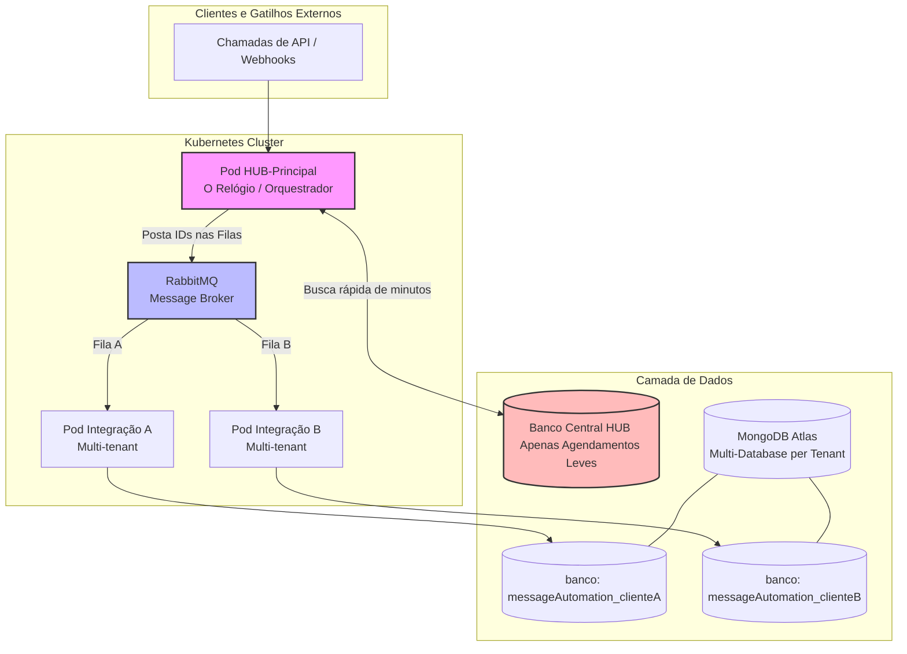
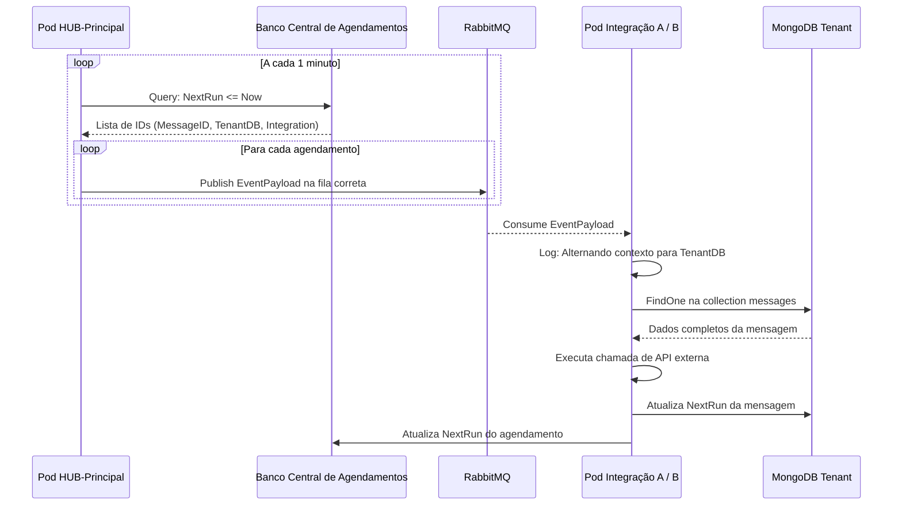

# 🏗️ Arquitetura do Novo HUB Multi-tenant com RabbitMQ (Solução 1)

## Introdução

Estamos saindo do modelo antigo, onde cada cliente possuía uma execução monolítica e pesada de cron, para uma arquitetura **SaaS Multi-tenant**, escalável e isolada no **Kubernetes (K8s)**. O novo HUB utiliza o **RabbitMQ** como message broker central, responsável por distribuir a carga de trabalho entre integrações especializadas.

Nessa nova engrenagem, o **HUB-Principal** atua apenas como o relógio/orquestrador: a cada minuto ele consulta uma **collection central de agendamentos**, descobre quais mensagens estão programadas para execução e publica eventos leves no RabbitMQ. As **Integrações A e B** consomem suas respectivas filas, alternam o contexto para o banco correto do cliente no MongoDB, executam as chamadas externas e atualizam os próximos agendamentos.

---

## 📌 1. Visão Geral do Ecossistema (Kubernetes)

No Kubernetes, o HUB principal e as Integrações rodam em **Pods totalmente separados e isolados**. Eles não se conhecem diretamente; toda a comunicação e distribuição de carga é feita pelas filas do **RabbitMQ**.

---

## 🕒 2. O Fluxo do Cron (Minuto em Minuto)

O segredo da performance está na **Fila de Agendamento Central**. Em vez de o HUB varrer os bancos individuais de todos os clientes a cada minuto, ele faz **uma única query leve** no banco central, buscando agendamentos onde `NextRun <= Now`. Para cada agendamento encontrado, ele publica um evento JSON contendo `MessageID` e `TenantDB` no RabbitMQ.

A Integração correta consome sua fila, alterna o contexto para o banco do cliente informado em `TenantDB`, busca os dados completos da mensagem na collection `messages`, executa a chamada de API externa e, por fim, atualiza a data de próxima execução tanto no banco do cliente quanto na tabela central.

---

## 🎯 3. Vantagens desse Modelo para a Equipe

- **Performance**: o HUB executa uma única query leve por minuto no banco central, eliminando loops pesados de conexão com centenas de bancos MongoDB de clientes.
- **Resiliência**: as filas do RabbitMQ seguram a carga de pico. Mesmo que uma integração fique lenta ou offline, os eventos continuam enfileirados e são processados assim que possível.
- **Escalabilidade**: cada integração pode ser escalada individualmente no K8s usando HPA (Horizontal Pod Autoscaler), aumentando réplicas apenas onde há fila acumulada.
- **Dinamismo**: novos clientes ou alterações de regras refletem na hora, pois o contexto é trocado a cada evento consumido, sem precisar reconfigurar ou reiniciar os Pods.
- **Isolamento de responsabilidades**: o HUB não conhece detalhes de integrações externas; ele apenas orquestra. Cada integração é independente e pode ser versionada/deployada separadamente.
